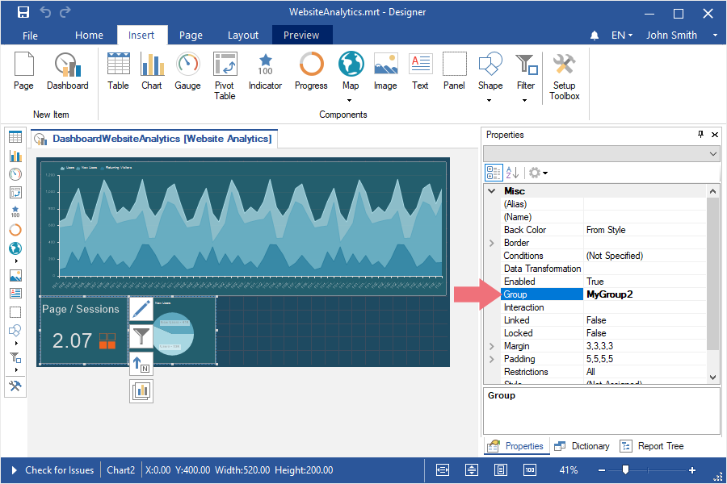
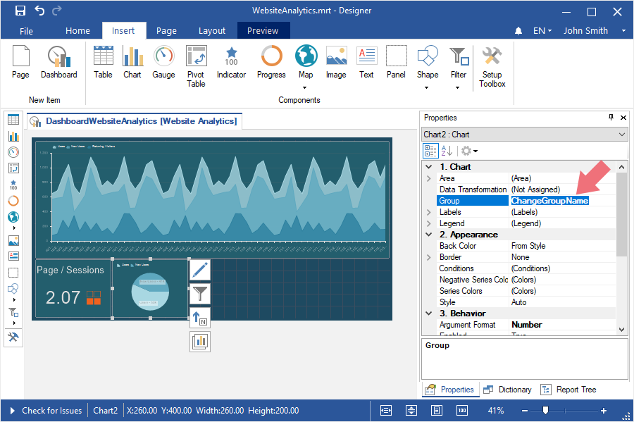

## Grouping elements on Dashboard

When developing a dashboard, you can divide its [elements into groups](../Dashboards/Groups.md).

The following questions will be considered in this chapter:

[The group of elements creation]();

[Changing a group for an element]();

[Deleting an element from a group]().

Elements group creation

To do it you should make the following actions:

Step 1: Create or open a dashboard;

Step 2: Select the dashboard elements. To select several elements, you should hold down the Ctrl and click the left mouse button on the input pointer;

Step 3: Assign the name of a group in the Group field in the properties panel in the report designer.

Changing group for an element
To do it you should make the following actions:

Step 1: Select an element;

Step 2: Change the value, by specifying the name of a new group in the field of the Group property.

Deleting element from the group

To do it you should make the following actions:

Step 1: Select an element on a dashboard;

Step 2: Delete a value in the field of the Group property.

