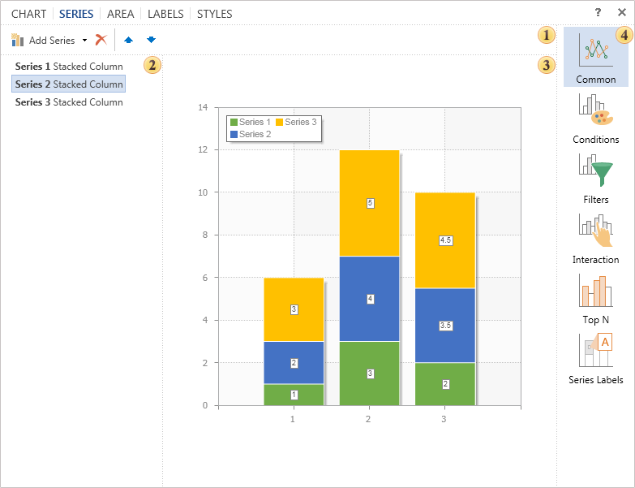

## Tab Series

Series of the chart component are the main element of the diagram. Series are important to visualize data. It should be understood that construction is not possible without series of the diagram.

 The toolbar contains the basic commands to control the chart series: adding series, deleting the selected one, moving the selected series in the list.

* **NOTICE**: If the chart type is defined on the **Chart** tab, in the menu of adding rows, only series of this type will only be available, and those that can interact with the type of a chart. If the chart type is not specified, the type of a chart will depend on the selected series.

 The list of chart series. As can be seen from the picture, this chart contains three rows.

 The preview panel. This panel displays the chart and immediately previews changes made in real time.

 The list of group of parameters of the tab Series:

* The group **Common**. You can find settings for the selected series. Among them are data source, data, etc.

* The group **Conditions**. Here you can set parameters for the selected series.

* The group **Filter**. Parameters of filtering of the selected series can be set here.

* The group **Interaction**. Here you can setup interaction of the series.

* The group **TopN**. In this group you can set maximum or minimum values​​.

* The group **Series Labels**. This group of parameters are used to define position, rotation for series labels etc.
