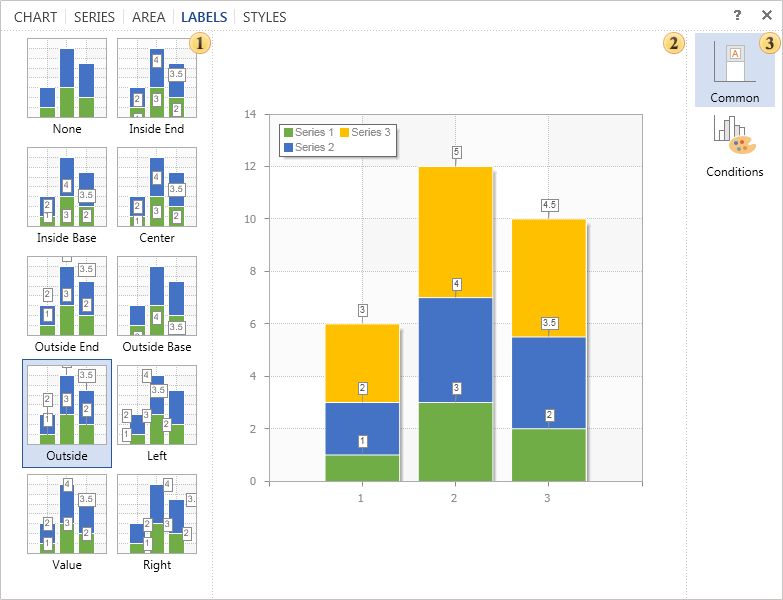

Tab Labels

On this tab you can set the type of labels in the chart. The selected appearance of the title will be applied to all rows that have the mode **Show Series** **Labels: From Series** disabled.

The picture below shows the tab Labels.

 This panel displays a list of different types of labels.

 The preview panel. This panel displays the chart and immediately previews changes made in real time.

 The list of groups of parameters:

* The group **Common**. You can find settings such as Text before, text after, rotation etc.

* The group **Conditions**. Here you can set parameters for the selected series.
